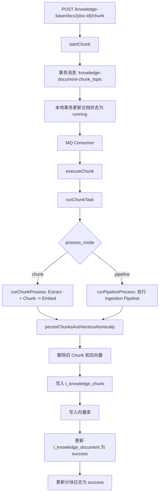

# 文档分块与 startChunk 流程说明

本文说明项目中文档分块的入口、异步执行链路、分块策略、向量化、持久化以及 Pipeline 分块模式。对应核心代码主要位于：

- `bootstrap/src/main/java/com/nageoffer/ai/ragent/knowledge/controller/KnowledgeDocumentController.java`
- `bootstrap/src/main/java/com/nageoffer/ai/ragent/knowledge/service/impl/KnowledgeDocumentServiceImpl.java`
- `bootstrap/src/main/java/com/nageoffer/ai/ragent/core/chunk/`
- `bootstrap/src/main/java/com/nageoffer/ai/ragent/ingestion/node/ChunkerNode.java`
- `bootstrap/src/main/java/com/nageoffer/ai/ragent/rag/core/vector/`
- `resources/database/schema_pg.sql`

## 总体结论

项目里的 `startChunk` 不是同步完成分块的接口。它只负责把文档状态改为 `running`，并通过 RocketMQ 事务消息投递一个文档分块任务。真正的“读取文件 -> 提取文本 -> 分块 -> embedding -> 写入 Chunk 表和向量库 -> 更新状态/日志”是在 MQ 消费端执行的。

文档分块有两种处理模式：

- `processMode=chunk`：使用内置分块流程，链路是 `Extract -> Chunk -> Embed -> Persist`。
- `processMode=pipeline`：使用 Ingestion Pipeline，典型链路是 `fetcher/parser/enhancer/chunker/indexer`。在知识库文档触发时会设置 `skipIndexerWrite=true`，最终仍由 `runChunkTask` 统一写入数据库和向量库。

## API 入口

### 上传文档

接口：

```http
POST /knowledge-base/{kb-id}/docs/upload
Content-Type: multipart/form-data
```

入口方法：

```java
KnowledgeDocumentController.upload(...)
```

业务方法：

```java
KnowledgeDocumentServiceImpl.upload(...)
```

上传阶段只保存文档元信息和文件，不立即分块。主要动作如下：

1. 校验知识库是否存在。
2. 校验来源类型，支持 `file` 和 `url`。
3. 把文件保存到对象存储，得到 `fileUrl`、`fileType`、`fileSize`。
4. 解析处理模式：
   - `chunk`：保存 `chunkStrategy` 和 `chunkConfig`。
   - `pipeline`：保存 `pipelineId`。
5. 插入 `t_knowledge_document`，初始状态为 `pending`，`chunk_count=0`。

### 开始分块

接口：

```http
POST /knowledge-base/docs/{doc-id}/chunk
```

入口方法：

```java
KnowledgeDocumentController.startChunk(...)
```

业务方法：

```java
KnowledgeDocumentServiceImpl.startChunk(...)
```

`startChunk` 做三件事：

1. 构造 `KnowledgeDocumentChunkEvent`，包含 `docId` 和当前操作人。
2. 发送 RocketMQ 事务消息，topic 为：

```text
knowledge-document-chunk_topic${unique-name:}
```

3. 在本地事务中尝试把文档状态更新为 `running`：

```java
.set(KnowledgeDocumentDO::getStatus, DocumentStatus.RUNNING.getCode())
.eq(KnowledgeDocumentDO::getId, docId)
.ne(KnowledgeDocumentDO::getStatus, DocumentStatus.RUNNING.getCode())
```

这里的 `.ne(status, running)` 是并发保护：如果文档已经在分块中，更新行数会是 0，然后抛出“正在分块中”的异常。

事务消息回查由 `KnowledgeDocumentChunkTransactionChecker` 完成。回查逻辑是：只要数据库中文档存在且状态已经是 `running`，就认为本地事务提交成功，MQ 消息可以继续投递。

## 异步消费链路

MQ 消费者：

```java
KnowledgeDocumentChunkConsumer.onMessage(...)
```

消费者收到消息后：

1. 从消息体取出 `docId` 和 `operator`。
2. 把 `operator` 写入 `UserContext`，保证后续 `createdBy/updatedBy` 有操作者。
3. 调用：

```java
documentService.executeChunk(event.getDocId());
```

`executeChunk` 查询文档记录，如果文档存在，则进入：

```java
runChunkTask(documentDO)
```

`runChunkTask` 是真正的一次完整分块任务。

## runChunkTask 主流程

`runChunkTask` 会先插入一条分块日志：

```text
t_knowledge_document_chunk_log
```

日志初始状态为 `running`，记录字段包括：

- `doc_id`
- `status`
- `process_mode`
- `chunk_strategy`
- `pipeline_id`
- `start_time`

然后根据文档的 `process_mode` 分流：

```text
process_mode = pipeline -> runPipelineProcess(documentDO)
process_mode = chunk    -> runChunkProcess(documentDO)
```

完整流程可以概括为：



如果任意阶段失败，`catch` 会执行：

1. `markChunkFailed(docId)`：把文档状态更新为 `failed`。
2. `updateChunkLog(...)`：把日志状态更新为 `failed`，记录 `error_message` 和耗时。

## chunk 模式：内置分块流程

内置流程由 `runChunkProcess` 执行，分为三步。

### 1. Extract：提取文本

代码从对象存储打开原始文件：

```java
fileStorageService.openStream(documentDO.getFileUrl())
```

然后固定使用 Tika 解析器抽取纯文本：

```java
parserSelector.select(ParserType.TIKA.getType())
    .extractText(is, documentDO.getDocName())
```

Tika 解析后会经过 `TextCleanupUtil.cleanup(text)` 清理。该解析器支持 PDF、Word、Excel、PPT、HTML、XML 等常见格式。

### 2. Chunk：按策略分块

先根据文档保存的策略构造配置：

```java
ChunkingMode chunkingMode = ChunkingMode.fromValue(documentDO.getChunkStrategy());
ChunkingOptions config = buildChunkingOptions(chunkingMode, documentDO);
```

然后从 `ChunkingStrategyFactory` 取对应策略：

```java
ChunkingStrategy chunkingStrategy = chunkingStrategyFactory.requireStrategy(chunkingMode);
List<VectorChunk> chunks = chunkingStrategy.chunk(text, config);
```

策略工厂会在启动时收集所有 `ChunkingStrategy` Bean，按 `ChunkingMode` 注册到 Map 中。如果同一个类型注册了多个实现，会直接启动失败。

### 3. Embed：生成向量

分块完成后调用：

```java
chunkEmbeddingService.embed(chunks);
```

`ChunkEmbeddingService` 会：

1. 跳过空列表。
2. 如果所有 chunk 都已经有 embedding，则不重复计算。
3. 把每个 `VectorChunk.content` 提取为文本列表。
4. 调用 Spring AI 的 `EmbeddingModel.embed(texts)` 批量生成向量。
5. 校验返回向量数量必须与 chunk 数一致，并写回每个 `VectorChunk.embedding`。

## 分块结果对象 VectorChunk

分块策略统一输出 `VectorChunk`：

```java
public class VectorChunk {
    private String chunkId;
    private Integer index;
    private String content;
    private Map<String, Object> metadata;
    private float[] embedding;
}
```

字段含义：

- `chunkId`：Chunk 唯一 ID，通常由雪花算法生成。
- `index`：在文档中的顺序，从 0 开始。
- `content`：分块文本内容。
- `metadata`：额外元数据，Pipeline 或增强节点可写入。
- `embedding`：向量表示，不直接序列化给前端。

## 内置分块策略

项目当前暴露两个可见策略：

```text
fixed_size
structure_aware
```

对应枚举：

```java
ChunkingMode.FIXED_SIZE
ChunkingMode.STRUCTURE_AWARE
```

前端或 API 可以通过：

```http
GET /knowledge-base/chunk-strategies
```

获取可用策略和默认配置。

### fixed_size：固定大小滑窗分块

实现类：

```java
FixedSizeTextChunker
```

配置对象：

```java
FixedSizeOptions
```

配置字段：

```json
{
  "chunkSize": 512,
  "overlapSize": 128
}
```

默认值：

- `chunkSize=512`
- `overlapSize=128`

特殊值：

- `chunkSize=-1`：不切分，整篇文档作为一个 chunk。

算法步骤：

1. 对文本做轻量归一化：
   - 去掉 `\r`。
   - 修复 URL 被换行拆开的情况，例如 `dingtalk.\ncom`。
   - 修复中文词中间的软换行，例如 PDF 抽取出的中文词被断行。
   - 尽量不破坏段落换行和列表结构。
2. 使用滑动窗口：
   - `start` 为当前块起点。
   - `targetEnd = start + chunkSize`。
   - 默认取 `[start, targetEnd)`。
3. 在 `targetEnd` 附近向前寻找更自然的边界：
   - 优先换行。
   - 其次中文句末标点。
   - 再其次英文 `. ! ?`，但要求后面是空白或文本结束，避免切断 URL 域名。
4. 生成 chunk。
5. 下一块从 `end - overlapSize` 开始，让相邻块保留上下文重叠。
6. 如果边界回退导致无法前进，则退回硬切点，防止死循环。

示例：

```text
文本: ABCDEFGHIJKLMNOP
chunkSize=10, overlapSize=2

chunk0: ABCDEFGHIJ
chunk1: IJKLMNOP
```

适用场景：

- 普通纯文本。
- 结构不明显的 PDF 抽取文本。
- 希望控制每块长度并保留重叠上下文。

注意点：

- 这里的大小按 Java 字符数计算，不是严格 token 数。
- `overlapSize` 会被限制在 `chunkSize - 1` 以内，避免窗口无法前进。

### structure_aware：结构感知分块

实现类：

```java
StructureAwareTextChunker
```

配置对象：

```java
TextBoundaryOptions
```

配置字段：

```json
{
  "targetChars": 1400,
  "overlapChars": 0,
  "maxChars": 1800,
  "minChars": 600
}
```

默认值：

- `targetChars=1400`
- `overlapChars=0`
- `maxChars=1800`
- `minChars=600`

算法目标是“尽量只在结构边界切分”，尤其适合 Markdown 或带明显段落结构的文本。

步骤如下：

1. 统一换行：
   - `\r\n` 转成 `\n`。
   - `\r` 转成 `\n`。
2. 扫描原文，识别结构块：
   - `HEADING`：Markdown 标题，匹配 `#{1,6} ...`。
   - `CODE`：代码围栏，匹配 ``` 开始和结束。
   - `ATOMIC`：整行图片或链接，例如 ``、`[...](...)`。
   - `PARA`：普通段落，以空行分段。
3. 保留原文 substring，不改写文本内容。
4. 按 `min/target/max` 把结构块打包成 chunk：
   - 只要加入下一个块不超过 `maxChars`，就继续加入。
   - 如果当前 chunk 小于 `minChars`，即使加入下一个块会超过 `maxChars`，也会尽量合并，避免过小 chunk。
   - 最后一个 chunk 如果太小，会尝试与前一个 chunk 合并。
5. 如果配置了 `overlapChars > 0`，不会从块中间切出 overlap，而是把上一个 chunk 末尾的一段原文复制到下一个 chunk 开头。
6. 最后重新分配从 0 开始的 `index`，并为每块生成 `chunkId`。

适用场景：

- Markdown 文档。
- 有标题、段落、代码块的知识库文档。
- 不希望代码块、图片链接、标题上下文被硬切断的场景。

注意点：

- 该策略更重视结构完整性，因此实际 chunk 长度可能超过 `targetChars`。
- 如果某个单独结构块本身很长，策略不会在块中间强行切开。

## pipeline 模式：通过 Ingestion Pipeline 分块

当文档 `process_mode=pipeline` 时，`runChunkTask` 会调用：

```java
runPipelineProcess(documentDO)
```

流程如下：

1. 校验文档必须有 `pipelineId`。
2. 读取知识库信息，拿到 `collectionName`。
3. 通过 `ingestionPipelineService.getDefinition(pipelineId)` 获取 Pipeline 定义。
4. 从对象存储读取文件字节数组。
5. 构造 `IngestionContext`：

```java
IngestionContext.builder()
    .taskId(docId)
    .pipelineId(pipelineId)
    .rawBytes(fileBytes)
    .mimeType(documentDO.getFileType())
    .vectorSpaceId(VectorSpaceId.builder()
        .logicalName(kbDO.getCollectionName())
        .build())
    .skipIndexerWrite(true)
    .build();
```

6. 调用：

```java
ingestionEngine.execute(pipelineDef, context)
```

7. 从执行结果里取 `result.getChunks()`。

这里的关键点是 `skipIndexerWrite=true`：Pipeline 中即使有 `indexer` 节点，也不会在节点内部完成最终写库，知识库文档分块仍统一回到 `runChunkTask` 的持久化阶段处理。

### Pipeline 中的 ChunkerNode

`ChunkerNode` 是 Pipeline 里的分块节点，节点类型是：

```text
chunker
```

它从上下文里取文本：

```java
String text = StringUtils.hasText(context.getEnhancedText())
        ? context.getEnhancedText()
        : context.getRawText();
```

也就是说，如果前面有 `enhancer` 节点产出增强文本，会优先使用增强后的文本；否则使用原始解析文本。

`ChunkerNode` 的配置对象是 `ChunkerSettings`：

```java
private ChunkingMode strategy;
private Integer chunkSize;
private Integer overlapSize;
private String separator;
```

默认值：

- `chunkSize=512`
- `overlapSize=128`

执行过程：

1. 解析节点配置。
2. 根据 `strategy` 从 `ChunkingStrategyFactory` 获取分块策略。
3. 用 `strategy.createDefaultOptions(chunkSize, overlapSize)` 转换配置。
4. 调用策略分块。
5. 调用 `ChunkEmbeddingService.embed(chunks)` 生成向量。
6. 把结果写入 `context.setChunks(chunks)`。

## 持久化流程

无论是 `chunk` 模式还是 `pipeline` 模式，最终都会进入：

```java
persistChunksAndVectorsAtomically(collectionName, docId, chunkResults)
```

它做的是统一持久化：

1. 把 `VectorChunk` 转成 `KnowledgeChunkCreateRequest`。
2. 开启事务。
3. 删除该文档旧的 Chunk：

```java
knowledgeChunkService.deleteByDocId(docId)
```

4. 批量写入新的 Chunk：

```java
knowledgeChunkService.batchCreate(docId, chunks)
```

5. 删除该文档旧向量：

```java
vectorStoreService.deleteDocumentVectors(collectionName, docId)
```

6. 写入新向量：

```java
vectorStoreService.indexDocumentChunks(collectionName, docId, chunkResults)
```

7. 更新文档状态为 `success`，并写入 `chunk_count`。

这里支持重复分块：每次成功分块前都会先清理旧 Chunk 和旧向量，避免残留旧结果。

## 数据库表

### t_knowledge_document

文档主表，分块相关字段包括：

- `chunk_count`：当前文档 Chunk 数量。
- `process_mode`：处理模式，默认 `chunk`。
- `status`：文档处理状态，例如 `pending/running/success/failed`。
- `chunk_strategy`：分块策略，例如 `fixed_size/structure_aware`。
- `chunk_config`：分块配置 JSON。
- `pipeline_id`：Pipeline 模式下使用的数据通道 ID。

### t_knowledge_chunk

Chunk 明细表：

- `id`：Chunk ID。
- `kb_id`：知识库 ID。
- `doc_id`：文档 ID。
- `chunk_index`：分块序号，从 0 开始。
- `content`：分块内容。
- `content_hash`：内容 SHA-256。
- `char_count`：字符数。
- `token_count`：估算或统计 token 数。
- `enabled`：是否启用。

### t_knowledge_document_chunk_log

分块任务日志表：

- `doc_id`：文档 ID。
- `status`：本次任务状态。
- `process_mode`：本次处理模式。
- `chunk_strategy`：本次分块策略。
- `pipeline_id`：本次 Pipeline ID。
- `extract_duration`：文本提取耗时。
- `chunk_duration`：分块耗时。
- `embed_duration`：向量化耗时。
- `persist_duration`：持久化耗时。
- `total_duration`：总耗时。
- `chunk_count`：本次生成 Chunk 数。
- `error_message`：失败原因。
- `start_time/end_time`：任务开始和结束时间。

前端可通过接口查询日志：

```http
GET /knowledge-base/docs/{docId}/chunk-logs
```

## 向量库写入

向量写入由 `VectorStoreService` 抽象：

```java
void indexDocumentChunks(String collectionName, String docId, List<VectorChunk> chunks);
void updateChunk(String collectionName, String docId, VectorChunk chunk);
void deleteDocumentVectors(String collectionName, String docId);
void deleteChunkById(String collectionName, String chunkId);
void deleteChunksByIds(String collectionName, List<String> chunkIds);
```

当前有两种实现。

### Milvus

实现类：

```java
MilvusVectorStoreService
```

启用条件：

```text
rag.vector.type=milvus
```

如果未显式配置，Milvus 是默认实现。

写入字段：

- `id`：Chunk ID。
- `content`：Chunk 内容，超过 65535 字符会截断。
- `metadata`：包含 `collection_name`、`doc_id`、`chunk_index` 等。
- `embedding`：向量数组。

删除文档向量时按 metadata 过滤：

```text
metadata["doc_id"] == "{docId}"
```

### PostgreSQL pgvector

实现类：

```java
PgVectorStoreService
```

启用条件：

```text
rag.vector.type=pg
```

写入表：

```text
t_knowledge_vector
```

插入 SQL 核心形式：

```sql
INSERT INTO t_knowledge_vector (id, content, metadata, embedding)
VALUES (?, ?, ?::jsonb, ?::vector)
```

metadata 中包含：

- `collection_name`
- `doc_id`
- `chunk_index`
- Chunk 自带的其他 metadata

删除文档向量时按 metadata 过滤：

```sql
DELETE FROM t_knowledge_vector
WHERE metadata->>'collection_name' = ?
  AND metadata->>'doc_id' = ?
```

## 配置示例

### 使用固定大小分块上传

```json
{
  "sourceType": "file",
  "processMode": "chunk",
  "chunkStrategy": "fixed_size",
  "chunkConfig": "{\"chunkSize\":512,\"overlapSize\":128}"
}
```

### 使用结构感知分块上传

```json
{
  "sourceType": "file",
  "processMode": "chunk",
  "chunkStrategy": "structure_aware",
  "chunkConfig": "{\"targetChars\":1400,\"overlapChars\":0,\"maxChars\":1800,\"minChars\":600}"
}
```

### 使用 Pipeline 处理

```json
{
  "sourceType": "file",
  "processMode": "pipeline",
  "pipelineId": "your_pipeline_id"
}
```

Pipeline 中典型 chunker 节点配置：

```json
{
  "nodeId": "chunker-1",
  "nodeType": "chunker",
  "settings": {
    "strategy": "fixed_size",
    "chunkSize": 512,
    "overlapSize": 128
  },
  "nextNodeId": "indexer-1"
}
```

## 状态与并发控制

文档状态大致流转：

```text
pending -> running -> success
pending -> running -> failed
success -> running -> success
success -> running -> failed
```

关键并发控制在 `startChunk`：

- 只有当前状态不是 `running` 时，才能更新为 `running`。
- 如果已经是 `running`，不会重复投递有效任务，会抛出业务异常。
- MQ 事务回查以文档状态是否为 `running` 作为本地事务是否成功的依据。

## 失败处理

失败可能发生在：

- 对象存储文件读取失败。
- Tika 文本提取失败。
- 分块策略执行失败。
- Embedding 调用失败或返回数量不一致。
- 数据库 Chunk 写入失败。
- 向量库写入失败。
- Pipeline 执行失败。

失败后：

1. 文档状态更新为 `failed`。
2. 分块日志更新为 `failed`。
3. `error_message` 保存异常消息。
4. 已经开始但未完成的事务会回滚；最终成功状态只会在 Chunk 和向量都写入成功后更新。

## 与手动 Chunk 管理的关系

除了整篇文档分块，项目还提供 Chunk 管理接口：

- 查询：`GET /knowledge-base/docs/{doc-id}/chunks`
- 新增：`POST /knowledge-base/docs/{doc-id}/chunks`
- 更新：`PUT /knowledge-base/docs/{doc-id}/chunks/{chunk-id}`
- 删除：`DELETE /knowledge-base/docs/{doc-id}/chunks/{chunk-id}`
- 启用/禁用：`PATCH /knowledge-base/docs/{doc-id}/chunks/{chunk-id}/enable`

这些接口由 `KnowledgeChunkServiceImpl` 处理。手动新增或更新 Chunk 时，会同步计算 embedding 并更新向量库。文档处于 `running` 状态时，不允许手动新增、修改或删除 Chunk。

## 排查建议

如果点击“开始分块”后没有结果，可以按以下顺序排查：

1. 查看 `t_knowledge_document.status` 是否变为 `running`。
2. 查看 RocketMQ topic `knowledge-document-chunk_topic${unique-name:}` 是否有消息消费。
3. 查看消费者 `KnowledgeDocumentChunkConsumer` 日志。

1. 查看 `t_knowledge_document_chunk_log` 的最新记录：
   - `status`
   - `error_message`
   - `extract_duration`
   - `chunk_duration`
   - `embed_duration`
   - `persist_duration`
2. 如果失败在 embedding，检查 Spring AI `EmbeddingModel` 配置和向量维度。
3. 如果失败在向量库，检查 `rag.vector.type`、Milvus/pgvector 连接和 collection/table 是否正常。
4. 如果是 Pipeline 模式，检查 Pipeline 定义中是否有能产出 `context.chunks` 的 `chunker` 节点。

## 一句话总结

`startChunk` 是“异步分块任务的启动器”，真正的分块由 MQ 消费端的 `runChunkTask` 完成；项目通过 `fixed_size` 和 `structure_aware` 两种内置策略生成 `VectorChunk`，再统一进行 embedding、写入 `t_knowledge_chunk` 和向量库，并用 `t_knowledge_document_chunk_log` 记录全过程耗时和错误。
