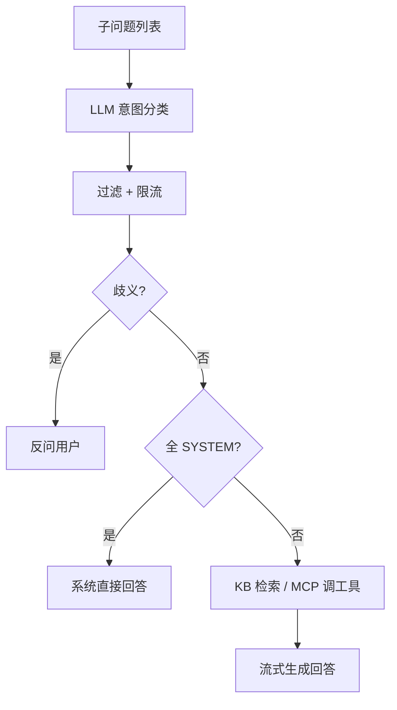

# 意图解析基本逻辑

> 上游：查询改写阶段产出 `subQuestions`（子问题列表）。详见 [query-rewrite.md](./query-rewrite.md)

---

## 1. 做什么

**意图解析**就是把用户问题（改写后的子问题）匹配到**意图树**上的知识分类节点，决定后续：

- 去哪个知识库检索（KB）
- 调哪个实时工具（MCP）
- 还是直接系统回答（SYSTEM，如打招呼）

一句话：**路由问题到正确的知识域或工具。**

---

## 2. 在流水线中的位置

```
加载记忆 → 查询改写 → 【意图解析】→ 歧义澄清 → 系统回答 / 检索 → 流式生成
```

意图解析的**输入**：改写阶段产出的子问题列表（通常 1 条，多问句时多条）。

意图解析的**输出**：每个子问题对应一组「意图节点 + 置信度分数」。

---

## 3. 基本流程

```
子问题列表
    │
    ├─ ① 对每个子问题，调用 LLM 做意图分类（多条子问题并行）
    │      · LLM 看到的是：全部候选分类 + 当前这条子问题
    │      · LLM 返回：匹配的分类 id 和 score（0~1）
    │
    ├─ ② 过滤低分意图（分数太低的丢弃）
    │
    ├─ ③ 限制意图总数（避免命中过多分类）
    │
    └─ ④ 输出：每个子问题 → 若干意图候选
```

### 意图树是什么

后台维护的一棵分类树，例如：

```
业务系统
  └─ OA系统
       ├─ 系统介绍（KB）
       ├─ 审批流程（KB）
       └─ 数据安全（KB）
```

只有**叶子节点**参与匹配。每个节点标记类型：**KB**（知识库）、**MCP**（工具）、**SYSTEM**（系统交互）。

---

## 4. 三种意图类型 → 后续怎么走

| 类型 | 含义 | 后续 |
|------|------|------|
| **KB** | 查知识库 | 走向量检索，把文档片段塞进 Prompt |
| **MCP** | 调实时工具 | 提取参数 → 调用工具 → 结果塞进 Prompt |
| **SYSTEM** | 系统交互 | 若唯一意图是 SYSTEM → 直接用预设话术回答，**不走检索** |

---

## 5. 解析结果怎么用

意图解析完成后，流水线按顺序判断：

```
意图解析结果
    │
    ├─ 歧义？（单问题 + 多个 KB 候选分数接近）
    │     → 是：反问用户「您指的是 A 还是 B？」，结束
    │
    ├─ 全是 SYSTEM？（如「你好」）
    │     → 是：直接系统回答，结束
    │
    └─ 否：按意图检索（KB 查文档 / MCP 调工具）→ 组装 Prompt → 流式回答
```

---

## 6. 典型场景

**单问题，意图明确**

- 问：「OA 移动端审批流程是什么」
- 匹配：`OA系统 > 审批流程`（score 0.9+）
- 结果：检索该知识库 → RAG 回答

**多问句**

- 问：「12306 订单流程？支付怎么处理？」
- 改写拆成 2 条子问题，各自独立分类、各自检索

**歧义**

- 问：「数据安全」（未指明哪个系统）
- 匹配：OA 数据安全 0.72、保险数据安全 0.70（分数接近）
- 结果：反问澄清，不检索

**系统交互**

- 问：「你好」
- 匹配：SYSTEM 欢迎语（唯一意图）
- 结果：直接回答，不检索

**匹配失败**

- LLM 返回空 / 分数全过低
- 结果：无意图候选 → 可能走兜底检索或提示「未找到相关文档」

---

## 7. 与查询改写的关系

| 阶段 | 回答的问题 |
|------|-----------|
| 查询改写 | 用户**说了什么**？要不要拆成多个子问题？ |
| 意图解析 | 每个子问题该去**哪个知识域 / 调哪个工具**？ |

改写管「问什么」，意图解析管「去哪找答案」。

---

## 8. 流程图



---

*文档版本：基本逻辑说明。*
