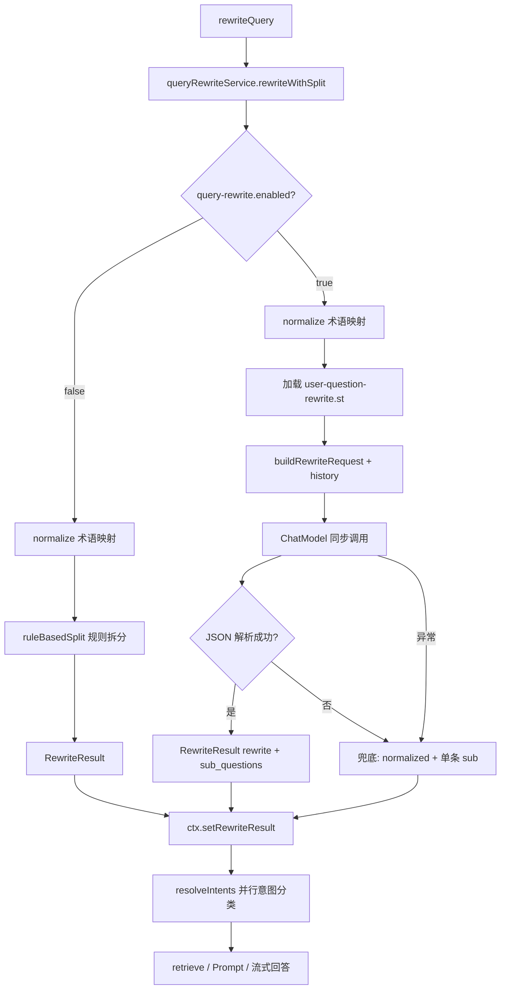

# rewriteQuery 查询改写详细说明

本文档描述 Ragent 在流式 RAG 对话流水线中 **`rewriteQuery` 阶段** 的完整逻辑，包括调用链、输入输出、分支策略、下游消费方式及配置项。

---

## 1. 在整体流水线中的位置

`rewriteQuery` 是 `StreamChatPipeline.execute()` 的 **第 2 步**（在 `loadMemory` 之后、`resolveIntents` 之前）。

```
用户提问 (GET /rag/v3/chat)
    │
    ▼
RAGChatController.chat()
    │
    ▼
RAGChatServiceImpl.streamChat()
    │  (限流 ChatQueueLimiter → Trace StreamChatTraceRunner)
    ▼
StreamChatPipeline.execute(ctx)
    │
    ├─ ① loadMemory(ctx)          加载历史 + 持久化本轮 user 消息
    ├─ ② rewriteQuery(ctx)       ← 本文档重点
    ├─ ③ resolveIntents(ctx)     对每个 subQuestion 做意图分类（详见 [intent-resolve.md](./intent-resolve.md)）
    ├─ ④ handleGuidance(ctx)     歧义澄清（可能短路）
    ├─ ⑤ handleSystemOnly(ctx)   纯 SYSTEM 意图（可能短路）
    ├─ ⑥ retrieve(ctx)           向量/MCP 检索
    ├─ ⑦ handleEmptyRetrieval    无检索结果（可能短路）
    └─ ⑧ streamRagResponse       组装 Prompt + 流式回答
```

### 1.1 Pipeline 入口代码

```java
// StreamChatPipeline.java
public void execute(StreamChatContext ctx) {
    loadMemory(ctx);
    rewriteQuery(ctx);
    resolveIntents(ctx);
    // ...
}

private void rewriteQuery(StreamChatContext ctx) {
    RewriteResult rewriteResult = queryRewriteService.rewriteWithSplit(
            ctx.getQuestion(),
            ctx.getHistory()
    );
    ctx.setRewriteResult(rewriteResult);
}
```

### 1.2 输入从哪里来

| 字段 | 来源 | 说明 |
|------|------|------|
| `ctx.getQuestion()` | 用户本次 SSE 请求的 `question` 参数 | 原始自然语言问题 |
| `ctx.getHistory()` | `loadMemory()` 刚填充 | **不含**本轮 question（见下文） |

`loadMemory` 的行为：

```java
List<ChatMessage> history = memoryService.loadAndAppend(
        conversationId, userId, ChatMessage.user(question)
);
ctx.setHistory(history);
```

- `loadAndAppend`：**先**从 DB 读出旧历史，**再**把本轮 user 消息写入 DB。
- **返回给 pipeline 的 `history` 是写入前的旧历史**，不包含当前 `question`。
- 当前问题单独通过 `ctx.getQuestion()` 传入改写逻辑。

---

## 2. 核心数据结构

### 2.1 StreamChatContext（改写相关字段）

```java
public class StreamChatContext {
    private final String question;           // 原始用户问题（不可变）
    private List<ChatMessage> history;       // 旧对话历史（可变，loadMemory 后赋值）
    private RewriteResult rewriteResult;     // rewriteQuery 后赋值
    private List<SubQuestionIntent> subIntents; // resolveIntents 后赋值
}
```

### 2.2 RewriteResult

```java
public record RewriteResult(
    String rewrittenQuestion,   // 改写后的主查询（用于歧义检测、系统-only 回答、Prompt 主问题）
    List<String> subQuestions   // 子问题列表（用于意图分类、检索、多问题 Prompt）
) {}
```

**两个字段的分工：**

| 字段 | 典型用途 |
|------|----------|
| `rewrittenQuestion` | 歧义引导 `detectAmbiguity`、SYSTEM-only 流式回答、最终 Prompt 的 `question` 参数 |
| `subQuestions` | `IntentResolver.resolve()` 对每个子问题并行做意图分类；检索引擎按子问题检索；多问题时 Prompt 编号展示 |

若 LLM 未返回 `sub_questions`，解析器会用 `rewrite` 作为唯一子问题。

---

## 3. 实现类与接口

| 类型 | 类名 | 说明 |
|------|------|------|
| 接口 | `QueryRewriteService` | 定义 `rewrite` / `rewriteWithSplit` |
| 实现 | `MultiQuestionRewriteService` | **唯一实现**，Spring `@Service` 注入到 Pipeline |
| 术语归一化 | `QueryTermMappingService` | 改写前的规则替换 |
| Prompt | `prompt/user-question-rewrite.st` | LLM 改写的 system prompt |

Pipeline 注入的是接口，运行时实际执行 `MultiQuestionRewriteService.rewriteWithSplit(question, history)`。

---

## 4. 完整处理流程（决策树）

```
rewriteWithSplit(userQuestion, history)
│
├─ rag.query-rewrite.enabled == false ?
│     YES → normalize(userQuestion)
│           → ruleBasedSplit(normalized)
│           → return RewriteResult(normalized, subs)
│     NO  ↓
│
├─ normalizedQuestion = normalize(userQuestion)   // 术语映射
│
└─ callLLMRewriteAndSplit(normalized, original, history)
      │
      ├─ 加载 system prompt (user-question-rewrite.st)
      ├─ buildRewriteRequest(prompt, normalized, history)
      ├─ SpringAiChatSupport.chat(chatModel, req)   // 同步调用 LLM
      ├─ parseRewriteAndSplit(raw) → RewriteResult ?
      │     YES → 打日志，返回 parsed
      │     NO  → 兜底 RewriteResult(normalized, [normalized])
      └─ 异常 → 同上兜底
```

---

## 5. 阶段 A：术语归一化（QueryTermMappingService）

在 LLM 改写**之前**（开关开/关都会执行），对用户问题做 **确定性字符串替换**。

### 5.1 规则加载 `loadMappings()`

```
Redis 缓存 (key: ragent:query-term:mappings)
    │ 命中 → filterApplicableMappings(cached)
    │ 未命中 ↓
DB: SELECT * FROM t_query_term_mapping WHERE enabled = 1
    → filterApplicableMappings()
    → sortMappings()
    → 写回 Redis（TTL 7 天）
```

### 5.2 规则过滤条件 `filterApplicableMappings`

仅保留：

- `enabled == 1`
- `matchType == null` 或 `matchType == 1`（**仅精确匹配已实现**）
- `sourceTerm`、`targetTerm` 非空

### 5.3 排序规则 `sortMappings`

1. `priority` **降序**（数值大的先匹配）
2. `sourceTerm` 长度 **降序**（长词优先，避免短词抢先替换）

### 5.4 替换算法 `QueryTermMappingUtil.applyMapping`

- 在文本中查找 `sourceTerm` 子串（`indexOf` 扫描）
- 若命中位置**已经是** `targetTerm` 的开头 → 不重复替换，跳过 target 长度
- 否则 → 替换为 `targetTerm`
- **非整词边界匹配**：子串命中即替换（例如 source=`报销` 会匹配「费用报销」中的「报销」）

### 5.5 配置入口

- 管理后台：`/admin/mappings`（关键词映射）
- API：`POST /api/ragent/mappings`
- 表：`t_query_term_mapping`

无规则时 `normalize()` 原样返回。

---

## 6. 阶段 B：开关关闭 — 纯规则路径

配置：

```yaml
rag:
  query-rewrite:
    enabled: false
```

逻辑：

```java
String normalized = queryTermMappingService.normalize(userQuestion);
List<String> subs = ruleBasedSplit(normalized);
return new RewriteResult(normalized, subs);
```

**不调用 LLM**，Trace 节点仍为 `query-rewrite-and-split`（带 `@RagTraceNode`）。

### 6.1 规则拆分 `ruleBasedSplit`

按正则 `[?？。；;\n]+` 切分：

```java
question.split("[?？。；;\\n]+")
```

- 去掉空白段
- 若切分结果为空 → 返回 `[question]`
- 否则每段若不以 `?`/`？` 结尾 → 自动补 `？`

**示例：**

| 输入 | subQuestions |
|------|----------------|
| `A是什么？B呢？` | `["A是什么？", "B呢？"]` |
| `只有一个问题？` | `["只有一个问题？"]` |
| `阿里使用的是钉钉么？` | `["阿里使用的是钉钉么？"]` |

注意：此规则拆分 **比 LLM 拆分更激进**（按标点切），与 LLM prompt 中的「抽象对比不拆分」策略不一致。

---

## 7. 阶段 C：开关开启 — LLM 改写 + 拆分

配置（默认）：

```yaml
rag:
  query-rewrite:
    enabled: true
```

### 7.1 System Prompt

文件路径：`bootstrap/src/main/resources/prompt/user-question-rewrite.st`

常量：`RAGConstant.QUERY_REWRITE_AND_SPLIT_PROMPT_PATH`

**LLM 任务：**

1. 将问题改写成适合 RAG 检索的查询
2. 判断是否需要拆成多个子问题

**要求输出 JSON（无多余文字）：**

```json
{
  "rewrite": "改写后的查询",
  "should_split": true,
  "sub_questions": ["子问题1", "子问题2"]
}
```

**注意：** 代码解析时 **不读取 `should_split` 字段**，只解析 `rewrite` 和 `sub_questions`。

**Prompt 核心规则摘要：**

| 类别 | 规则 |
|------|------|
| 保留 | 专有名词、时间/环境/角色限制、业务场景 |
| 删除 | 「请帮我」、「详细说明」、无关自述 |
| 禁止 | 添加原文没有的条件；改专有名词；引入「方面/维度」 |
| 拆分 | 多问句、显式列举、分号/换行 |
| 不拆分 | 抽象对比（X和Y区别）、笼统「哪些方面」、不确定时 |
| 指代 | 结合历史消息消解「它/这个」 |

### 7.2 构造 LLM 请求 `buildRewriteRequest`

消息顺序：

```
1. SystemMessage  → user-question-rewrite.st 全文
2. 最近历史（最多 4 条 USER/ASSISTANT，过滤掉 SYSTEM 摘要）
3. UserMessage      → normalizedQuestion（术语归一化后的问题，非原始 question）
```

历史截取逻辑：

```java
history.stream()
    .filter(msg -> USER || ASSISTANT)
    .skip(Math.max(0, history.size() - 4))
    .toList();
```

**LLM 参数：**

| 参数 | 值 |
|------|-----|
| temperature | 0.1 |
| topP | 0.3 |
| thinking | false |

### 7.3 解析 LLM 响应 `parseRewriteAndSplit`

1. `LLMResponseCleaner.stripMarkdownCodeFence(raw)` — 去掉 ` ```json ` 包裹
2. Gson 解析 JSON 对象
3. 读取 `rewrite`（必填，blank 则解析失败）
4. 读取 `sub_questions` 字符串数组（可选）
5. 若 `sub_questions` 为空 → 设为 `[rewrite]`
6. 返回 `new RewriteResult(rewrite, subs)`

**解析失败或 LLM 异常时的兜底：**

```java
return new RewriteResult(normalizedQuestion, List.of(normalizedQuestion));
```

即：**术语归一化结果**作为改写结果，**单个子问题**。

### 7.4 成功时的日志

```
RAG用户问题查询改写+拆分：
原始问题：{originalQuestion}
归一化后：{normalizedQuestion}
改写结果：{parsed.rewrittenQuestion}
子问题：{parsed.subQuestions}
```

---

## 8. Trace 追踪

| 方法 | Trace 节点名 | 类型 |
|------|--------------|------|
| `rewrite(String)` | `query-rewrite` | REWRITE |
| `rewriteWithSplit(q, history)` | `query-rewrite-and-split` | REWRITE |

可在管理后台 **链路追踪** `/admin/traces` 查看该节点耗时与状态。

---

## 9. 下游如何消费 RewriteResult

### 9.1 意图解析 `resolveIntents`

```java
List<String> subQuestions = CollUtil.isNotEmpty(rewriteResult.subQuestions())
        ? rewriteResult.subQuestions()
        : List.of(rewriteResult.rewrittenQuestion());

// 对每个 subQuestion 并行 intentClassifier.classifyTargets(q)
```

- **检索和意图分类的粒度是 `subQuestions`，不是 `rewrittenQuestion`**
- 若拆成 2 个子问题 → 2 路并行意图分类 → 可能产生 2 组 KB/MCP 意图

### 9.2 歧义引导 `handleGuidance`

```java
guidanceService.detectAmbiguity(
    ctx.getRewriteResult().rewrittenQuestion(),  // 用 rewrittenQuestion
    ctx.getSubIntents()
);
```

- 仅当 **恰好 1 个子问题** 且 top-2 意图分数接近时，才可能弹出澄清
- 使用 **改写后的主问题** 做系统名匹配（跳过澄清）

### 9.3 向量/MCP 检索 `retrieve`

```java
retrievalEngine.retrieve(ctx.getSubIntents(), topK);
```

每个 `SubQuestionIntent` 携带一个 `subQuestion` 文本，检索时使用该文本生成 embedding / 调用 MCP。

### 9.4 最终 Prompt 组装 `streamRagResponse`

```java
PromptContext.builder()
    .question(rewriteResult.rewrittenQuestion())
    // ...

promptBuilder.buildStructuredMessages(
    promptContext,
    history,
    rewriteResult.rewrittenQuestion(),
    rewriteResult.subQuestions()
);
```

`RAGPromptService.buildUserQuestion`：

- **1 个子问题** → 渲染 `single-question` 模板
- **多个子问题** → 渲染 `multi-questions` 模板，格式：

```
1. 子问题一
2. 子问题二
```

---

## 10. 端到端示例

### 示例 1：无术语映射 + LLM 改写（默认配置）

**输入：**

- question: `请帮我详细介绍一下12306系统的架构`
- history: `[]`
- query-rewrite.enabled: `true`

**流程：**

1. normalize → 无规则，不变
2. LLM → 期望类似：

```json
{
  "rewrite": "12306系统的架构",
  "should_split": false,
  "sub_questions": ["12306系统的架构"]
}
```

3. `RewriteResult("12306系统的架构", ["12306系统的架构"])`

---

### 示例 2：术语映射 + 多问句

**规则：** `钉钉` → `阿里钉钉`

**输入：** `钉钉和飞书怎么对接？审批流程是什么？`

1. normalize → `阿里钉钉和飞书怎么对接？审批流程是什么？`
2. LLM 可能拆成 2 个子问题
3. `IntentResolver` 对 2 条 subQuestion 分别做意图分类
4. 检索引擎分别检索
5. 最终 Prompt 以编号多问题形式展示

---

### 示例 3：开关关闭

**输入：** `12306的订单流程是什么？支付环节怎么处理？`

1. normalize（若有规则则替换）
2. ruleBasedSplit → `["12306的订单流程是什么？", "支付环节怎么处理？"]`
3. **不调用 LLM**
4. `rewrittenQuestion` = 归一化后的整句原文

---

### 示例 4：LLM 失败兜底

**输入：** `OA移动端审批`

1. normalize → 不变
2. LLM 超时/返回非 JSON
3. 兜底：`RewriteResult("OA移动端审批", ["OA移动端审批"])`

---

## 11. 配置与依赖汇总

### 11.1 应用配置

| 配置项 | 默认值 | 作用 |
|--------|--------|------|
| `rag.query-rewrite.enabled` | `true` | 是否调用 LLM 改写；false 时仅术语映射 + 规则拆分 |
| `spring.ai.openai.*` | — | 改写 LLM 使用全局 `ChatModel`（与对话共用模型配置） |

### 11.2 数据依赖

| 依赖 | 用途 |
|------|------|
| `t_query_term_mapping` + Redis | 术语归一化规则 |
| `prompt/user-question-rewrite.st` | LLM 改写 system prompt |
| 会话历史表 | `buildRewriteRequest` 中的指代消解上下文 |

### 11.3 关键源码索引

| 文件 | 职责 |
|------|------|
| `StreamChatPipeline.java` | `rewriteQuery()` 入口 |
| `MultiQuestionRewriteService.java` | 改写 + 拆分主逻辑 |
| `QueryTermMappingService.java` | 术语归一化 |
| `QueryTermMappingUtil.java` | 字符串替换算法 |
| `RewriteResult.java` | 结果 DTO |
| `IntentResolver.java` | 消费 subQuestions |
| `RAGPromptService.java` | 消费 rewrittenQuestion + subQuestions |
| `IntentGuidanceService.java` | 消费 rewrittenQuestion |

---

## 12. 设计要点与注意事项

1. **原始问题 vs 归一化问题 vs 改写结果**
   - DB 持久化的是 **原始** `ctx.getQuestion()`
   - LLM 改写输入的是 **归一化后** 文本
   - 检索/意图用的是 **subQuestions**（LLM 输出或兜底）

2. **`should_split` 字段未被代码使用**
   - 仅以 `sub_questions` 数组长度为准
   - Prompt 要求不拆分时 `sub_questions` 与 `rewrite` 一致

3. **history 不含本轮问题**
   - 本轮问题通过 `ctx.getQuestion()` / normalize 后作为最后一条 user 消息给改写 LLM
   - 避免重复，但需理解指代消解依赖「旧 history + 当前 normalized question」

4. **规则拆分 vs LLM 拆分**
   - `enabled=false` 时用标点拆分，可能把「A和B有什么区别」误拆（若含分隔符）
   - `enabled=true` 时 LLM 按 prompt 约束，通常不拆抽象对比

5. **改写是同步阻塞调用**
   - 在 SSE 流水线线程内同步 `chatModel.call()`
   - 失败有兜底，不会中断整个对话（除非兜底结果仍导致后续阶段失败）

6. **与最终回答 LLM 是两次独立调用**
   - 改写：`temperature=0.1`, `thinking=false`
   - 回答：`streamRagResponse` 中另一次流式调用，参数不同

---

## 13. 流程图（Mermaid）



---

*文档版本：基于当前 `bootstrap` 模块源码整理。*
